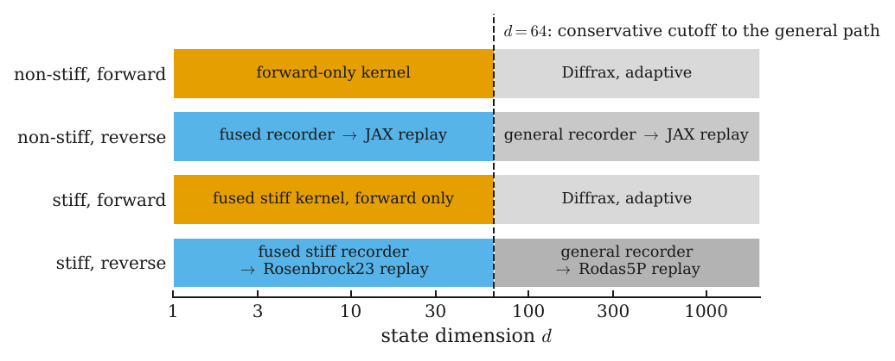
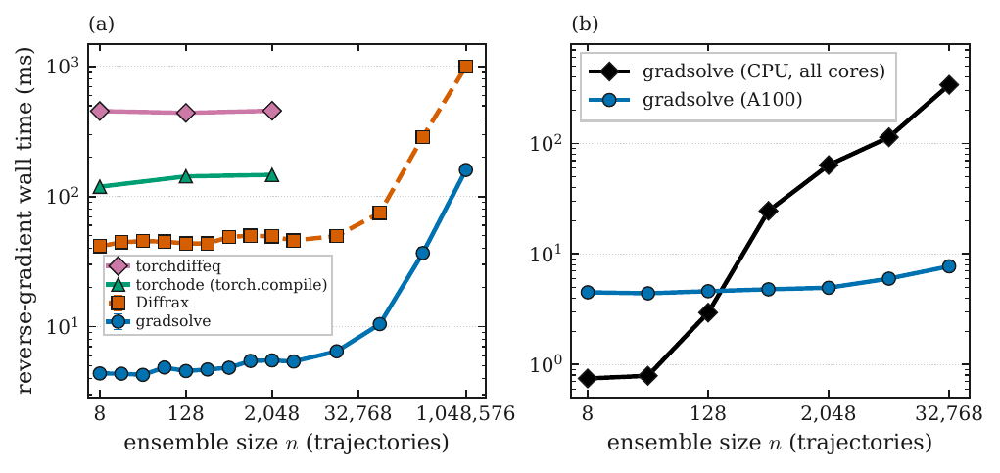
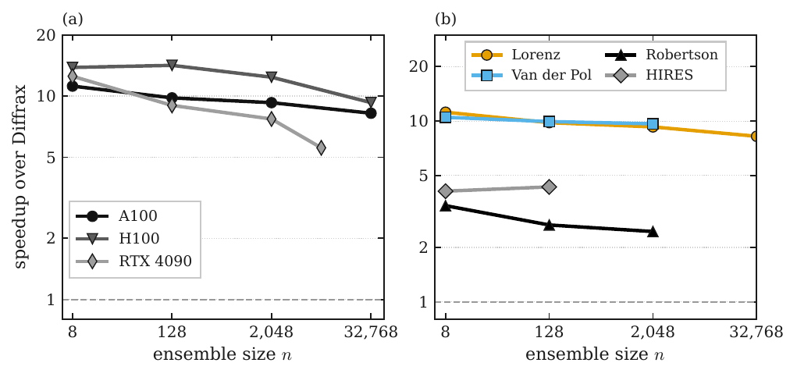
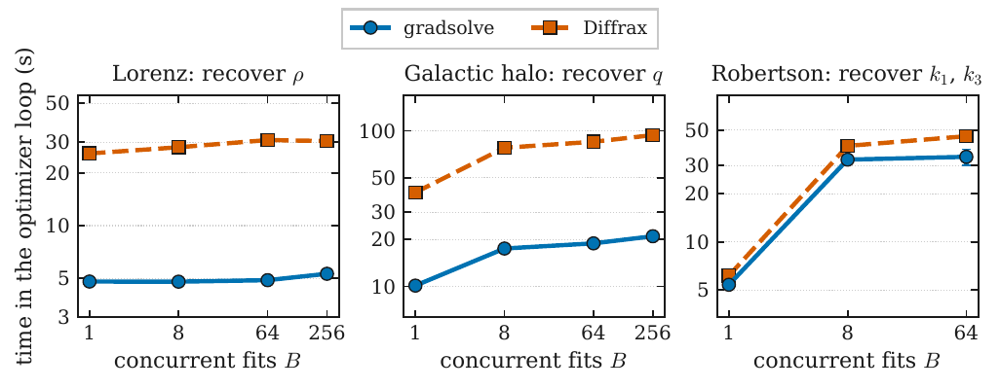

<p align="center">
  <picture>
    <source media="(prefers-color-scheme: dark)" srcset="docs/assets/logo/gradsolve-lockup-dark.svg">
    
  </picture>
</p>

<p align="center">
  <a href="https://github.com/ECLIPSE-AI4Science/gradsolve/actions/workflows/ci.yml"></a>
  <a href="LICENSE"></a>
  
  <a href="https://colab.research.google.com/github/ECLIPSE-AI4Science/gradsolve/blob/main/examples/notebooks/getting_started.ipynb"></a>
</p>

<p align="center">
  <a href="#installation">Installation</a> •
  <a href="#quickstart">Quickstart</a> •
  <a href="#documentation">Documentation</a> •
  <a href="#how-it-works">How it works</a> •
  <a href="#performance">Performance</a> •
  <a href="#citation">Citation</a>
</p>

**Differentiable ensemble solvers for differential equations on GPUs, in JAX.**

`gradsolve` solves large ensembles of ordinary differential equations on a GPU: many trajectories with
different parameters or initial conditions at once. It returns an exact reverse-mode gradient
through the solve. One call each: `gradsolve.solve` for the forward solve, `gradsolve.grad_closure`
for a function you can hand to `jax.grad`. The gradient comes from a record-and-replay adjoint: the
forward pass records the step sizes the adaptive solver accepted, and the backward pass replays them
as a fixed-length scan, which costs far less than differentiating the adaptive loop itself. At matched
accuracy and in double precision, the reverse-mode gradient of a Lorenz ensemble costs 5.6 to 14.1
times less than diffrax's checkpointed adjoint across an A100, an H100 and an RTX 4090.

## Installation

```bash
pip install gradsolve
```

Optional extras add engines gradsolve can route to:

```bash
pip install 'gradsolve[diffrax]'   # the diffrax engine: general adaptive solves (forward, and reverse on explicit request)
pip install 'gradsolve[warp]'      # fused NVIDIA Warp kernels (CPU or NVIDIA GPU)
pip install 'gradsolve[cuda12]'    # JAX CUDA 12 wheels plus the Warp kernels; needs nvcc on PATH
pip install 'gradsolve[all]'       # diffrax and warp together
pip install 'gradsolve[reproduce]' # matplotlib, jupyter, nbconvert, pandas: the tutorials and notebooks
```

From source:

```bash
git clone https://github.com/ECLIPSE-AI4Science/gradsolve
cd gradsolve && pip install -e '.[test]' && pytest -q
```

Importing `gradsolve` enables float64 in JAX, because its solvers and error control are tuned for
double precision. Set `GRADSOLVE_X64=0` in the environment before importing to opt out.

## Quickstart

A problem is any object with the six members below; there is no base class to inherit.
gradsolve maps `f_jax` over the whole ensemble.

```python
import gradsolve, jax, jax.numpy as jnp, numpy as np

class Lorenz:                          # a problem: any object with these six members
    name = "user_lorenz"               # a label; a registered name (built-in or via register_jax_field) selects a fused kernel
    dim = 3                            # number of state components
    t0, t1 = 0.0, 1.0                  # time span
    is_stiff = False                   # False: explicit engines; True: implicit engines for stiff systems

    def f_jax(self, t, y, p):          # the right-hand side dy/dt of one trajectory: y has shape (dim,), p its parameters
        rho = p[0]                     # sigma = 10 and beta = 8/3 are fixed; rho is the parameter
        return jnp.stack([10.0 * (y[1] - y[0]), rho * y[0] - y[1] - y[0] * y[2], y[0] * y[1] - (8.0 / 3.0) * y[2]])

problem = Lorenz()
y0 = np.tile([1.0, 0.0, 0.0], (16, 1))           # 16 trajectories, shape (n, dim)
params = np.linspace(20, 30, 16)[:, None]        # one rho per trajectory, shape (n, P)

result = gradsolve.solve(problem, y0, params, device="cpu")     # the router picks the engine
print(result.solver, result.y_final.shape)       # diffrax (16, 3)   (tsit5_replay without the diffrax extra)

final_states = gradsolve.grad_closure(problem, y0, params, device="cpu")   # records the accepted step sizes once
loss = lambda p: jnp.sum(final_states(p) ** 2)
gradient = jax.grad(loss)(jnp.asarray(params))
print(gradient.shape)                            # (16, 1): d loss / d rho, one gradient per trajectory
```

Ten runnable tutorials live in [`examples/`](examples/), the last one on a GPU, and a guided
notebook in [`examples/notebooks/getting_started.ipynb`](examples/notebooks/getting_started.ipynb).

## Documentation

- [eclipse-ai4science.github.io/gradsolve](https://eclipse-ai4science.github.io/gradsolve/): the pages
  below as a website.
- [`docs/index.md`](docs/index.md): the documentation index, with links to the contributing guide
  and changelog.
- [`docs/quickstart.md`](docs/quickstart.md): install, first solve, first gradient.
- [`docs/guide.md`](docs/guide.md): the problem contract, routing, stiff problems, the
  record-and-replay adjoint, memory.
- [`docs/api.md`](docs/api.md): `solve`, `grad_closure`, `register_jax_field`, the engine registry.
- [`examples/README.md`](examples/README.md): the tutorials.
- [`benchmarks/README.md`](benchmarks/README.md): time gradsolve against diffrax (reverse mode) and against
  DiffEqGPU.jl (forward only) on your own hardware.

## How it works

**Record and replay.** An adaptive solver chooses its step sizes as it goes, and differentiating
through that choice is expensive. gradsolve runs the forward solve once, records the sequence of
accepted step sizes for every trajectory, and computes the gradient by replaying that fixed sequence
as a `jax.lax.scan`, which JAX differentiates in reverse mode by construction. The result is the
exact discrete adjoint of the replayed integration with the step sizes held fixed. Because the step
sizes are data rather than a function of the parameters, a closure from `grad_closure` is valid near
the parameters it was recorded at; call `grad_closure` again to re-record after a large move.

**Routing.** `solve` and `grad_closure` pick an engine from the state dimension, the stiffness
flag, and whether a gradient is needed (`gradsolve.dispatch.choose_engine`). Read `res.route` or
`f.route` to see which engine ran and why.

| Problem | Forward | Gradient |
|---|---|---|
| A registered field (built-ins such as Lorenz, Van der Pol, Robertson, HIRES, or your own via `register_jax_field`) with `dim ≤ 64` and the `warp` extra installed | fused CUDA or Warp kernel, one thread per trajectory | the fused forward records the accepted step sizes; a pure-JAX replay gives the gradient |
| Anything else: an unregistered `f_jax`, `dim > 64`, or a registered field without the `warp` extra | diffrax when installed, otherwise the record-and-replay engine | record-and-replay through your own `f_jax` (`tsit5_replay` nonstiff, `rodas5p_replay` stiff) |
| An explicit `engine=` | any engine in the registry, including the fixed-step scans | as listed in [`docs/api.md`](docs/api.md) |



The map is drawn from the routing table in the source (`gradsolve.dispatch.DECISION_MAP`).

**Your own fused kernel.** `gradsolve.register_jax_field(name, f_jax, dim, n_params, stiff=False)`
translates a JAX right-hand side (and its Jacobian, for stiff problems) into the same fused Warp
field the built-in problems use, so a problem with that `name` routes to the fused engines.
`examples/08_fused_kernel_from_jax.py` shows the whole flow.

## Performance

Every measurement below is in double precision and compares solvers at the same achieved accuracy
(the error actually reached, not the tolerance requested), on an A100, with the cross-GPU panel
adding an H100 and an RTX 4090. To re-measure on your own hardware, the notebooks in
[`benchmarks/`](benchmarks/README.md) time the reverse-mode comparison against diffrax and the
forward-only comparison against DiffEqGPU.jl.



Wall time of one reverse-mode gradient against ensemble size on an A100, for gradsolve, diffrax,
torchode and torchdiffeq (left), and gradsolve on a CPU against the A100 (right).



Speedup over diffrax for the reverse-mode gradient on three GPUs (left) and across problem families
on the A100 (right).



Time spent in the optimiser loop to fit parameters, against the number of fits run concurrently, on
the A100.

## Citation

If you use gradsolve in your research, please cite the article that describes it
([arXiv:2609.02876](https://arxiv.org/abs/2609.02876)):

```bibtex
@misc{spuriomancini2026,
  title         = {GRADSOLVE: fast exact gradients for ODE ensembles on GPUs},
  author        = {Alessio Spurio Mancini},
  year          = {2026},
  eprint        = {2609.02876},
  archivePrefix = {arXiv},
  primaryClass  = {cs.MS},
  url           = {https://arxiv.org/abs/2609.02876},
}
```

GitHub's "Cite this repository" button reads [`CITATION.cff`](CITATION.cff), which points at the same
article.

### Citing what your solve used

gradsolve implements published methods, and some of its engines run on Diffrax or NVIDIA Warp.
`.route.actual` on a `SolveResult` or on a `grad_closure` closure names the engine that ran;
please also cite what that engine used:

- **Diffrax** (the `diffrax` engine: the forward fallback whenever a fused kernel cannot serve a
  problem and Diffrax is installed, and the reverse engine when asked for by name): Kidger, P.
  (2021), *On Neural Differential Equations*, PhD thesis, University of Oxford. That engine runs
  Diffrax's `Tsit5` (non-stiff) or `Kvaerno5` (stiff) with a `PIDController` and
  `RecursiveCheckpointAdjoint`; `diffrax.citation(...)`, called with the arguments you would pass
  to `diffeqsolve`, prints the BibTeX for those.
- **NVIDIA Warp** (`warp_ode`, `warp_rosenbrock`, `warp_replay`, `fused_rosenbrock_backward`):
  Macklin, M. (2022), *Warp: A High-performance Python Framework for GPU Simulation and Graphics*,
  NVIDIA GTC, https://github.com/NVIDIA/warp.
- **Tsit5** (`fixed_step_tsit5`, `tsit5_replay`, `warp_ode`, `warp_replay`, `cuda_tsit5`):
  Tsitouras, Ch. (2011), Computers & Mathematics with Applications 62, 770–775,
  doi:10.1016/j.camwa.2011.06.002.
- **Vern7** (`vern7_replay`): Verner, J. H. (2010), Numerical Algorithms 53, 383–396,
  doi:10.1007/s11075-009-9290-3.
- **Rosenbrock23** (`warp_rosenbrock`, `cuda_rosenbrock23`, `fused_rosenbrock_backward`):
  Shampine, L. F. and Reichelt, M. W. (1997), *The MATLAB ODE Suite*, SIAM Journal on Scientific
  Computing 18, 1–22, doi:10.1137/S1064827594276424.
- **Rodas5P** (`rodas5p_replay`): Steinebach, G. (2023), BIT Numerical Mathematics 63, 27,
  doi:10.1007/s10543-023-00967-x.
- **Kvaerno5** (inside the `diffrax` engine on stiff problems): Kværnø, A. (2004), BIT Numerical
  Mathematics 44, 489–502, doi:10.1023/B:BITN.0000046811.70614.38.
- **Linearly implicit Euler** (`fixed_step_imex`): Hairer, E. and Wanner, G. (1996), *Solving
  Ordinary Differential Equations II*, Springer, doi:10.1007/978-3-642-05221-7.

## License

MIT. See [`LICENSE`](LICENSE).
