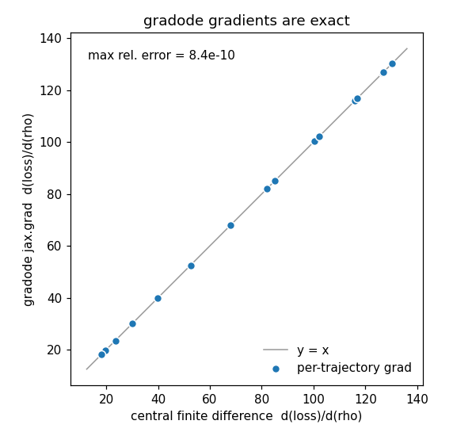

# gradsolve examples

Ten self-contained tutorials, numbered in reading order. Each is a single file that imports
only `gradsolve` (plus `numpy`/`jax`), defines its own right-hand side, and prints a final `OK`
line when it succeeds. `00` to `08` run on CPU with no data files and no GPU; `09` runs the
forward solve and the gradient on a GPU when JAX finds one and exits quietly otherwise. `04` and
`08` exercise the fused Warp kernels (on Warp's CPU backend), so they need the `warp` extra
(`pip install 'gradsolve[warp]'`); `09` needs the `cuda12` extra and an NVIDIA GPU; the others
need only a plain `pip install gradsolve`.

Run any one from the environment in which gradsolve is installed (see the [install
section](../docs/quickstart.md#install)):

```bash
python examples/00_standalone.py
```

The `Problem` contract every tutorial uses is duck-typed and tiny: attributes `name`, `dim`,
`t0`, `t1`, `is_stiff`, and a JAX right-hand side `f_jax(t, y, params)`. It is called
**per trajectory** — `y` has shape `(dim,)` and `params` has shape `(P,)`; gradsolve `vmap`s it
over the whole ensemble for you.

## Tutorials

| script | demonstrates | ~runtime | expected final line |
|---|---|---|---|
| `00_standalone.py` | Your own RHS through gradsolve: forward solve plus reverse-mode gradient, no registry needed. | ~2 s | `OK — standalone forward + reverse-mode gradient through gradsolve` |
| `01_quickstart.py` | The shortest forward ensemble solve; `engine="auto"` routing. | ~1.5 s | `OK` |
| `02_reverse_grad.py` | Reverse-mode gradient through the solve via `grad_closure`, checked against a finite difference. | ~2 s | `OK` |
| `03_engine_routing.py` | How `choose_engine` routes across the (dim, stiff, need_grad) cube; prints the `DECISION_MAP` table. | ~1.5 s | `OK — choose_engine agrees with DECISION_MAP on every row` |
| `04_reverse_through_fused.py` | Reverse-mode gradient through the routed fused record-and-replay kernel (a registered field). | ~2 s | `OK — reverse-mode through the fused-ensemble path is correct` |
| `05_bring_your_own_ode.py` | The full `Problem` contract on a 4-parameter Lotka-Volterra ensemble. | ~2.5 s | `OK — bring-your-own ODE: forward + reverse-mode gradient over 4 parameters` |
| `06_stiff.py` | Stiff routing: the general stiff engines (diffrax for the forward solve when installed, `rodas5p_replay` for the gradient) against the registered `warp_rosenbrock`, same physics. | ~3 s | `OK — stiff forward + reverse-mode gradient correct on both paths` |
| `07_saveat_timeseries_fit.py` | Fitting a parameter to a time series via `saveat`, not just a final state; re-records the mesh each outer step. | ~3 s | `OK` |
| `08_fused_kernel_from_jax.py` | `register_jax_field`: translate your own `f_jax` into the fused Warp kernel; forward `warp_ode` + reverse `warp_replay`, FD-checked. | ~3 s | `OK — fused kernel generated from a user f_jax: forward warp_ode + reverse warp_replay` |
| `09_gpu.py` | The forward solve and the reverse-mode gradient of a 131072-trajectory Lorenz ensemble on a GPU: `cuda_tsit5` (or `warp_ode`) forward, `warp_replay` gradient, each timed; prints which engine ran. Skips without a GPU. | ~7 s on an H200 | `OK — forward solve and reverse-mode gradient ran on the GPU` |

Runtimes are wall-clock on CPU (`09`: on an H200); the first run of a fresh process pays a one-time JIT compilation
cost included above. A non-zero exit or a missing `OK` line signals a failure.

## Notebook

For a narrated walk-through of the same material, see
[`notebooks/getting_started.ipynb`](notebooks/getting_started.ipynb):

```bash
jupyter notebook examples/notebooks/getting_started.ipynb
```

The notebook needs Jupyter and matplotlib, which the base `pip install gradsolve` does not
pull in. Install them with the `reproduce` extra: `pip install 'gradsolve[reproduce]'`
(matplotlib, jupyter, nbconvert, pandas).

## The gradient is exact

The figure below scatters `jax.grad` through `gradsolve.grad_closure` against a central finite
difference of the same scalar loss, for a small Lorenz ensemble. The points land on `y = x` (largest
relative error about 1e-9); `02_reverse_grad.py` runs the same check.



## Beyond these tutorials

Notebooks that time gradsolve against diffrax and against DiffEqGPU.jl on your own hardware are in [`../benchmarks/README.md`](../benchmarks/README.md). These ten
tutorials and the figure above are the complete, self-contained example set for the library itself.
